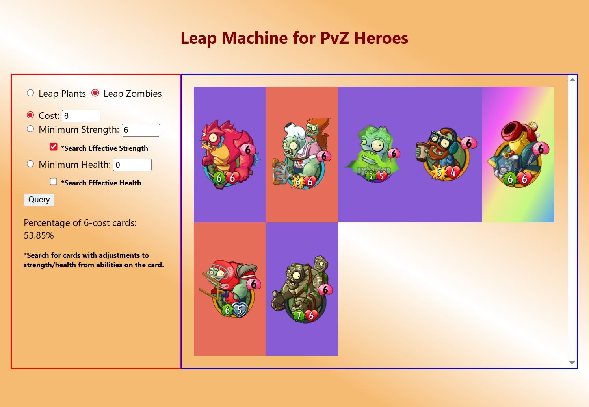

# PvZHeroes-Leaper
This is a JavaScript and dynamic HTML program that assists players when playing Plants Vs. Zombies Heroes. 

It houses every unit in PvZ Heroes and allows the user to query them to see the leap pool for target plants/zombies (when using cards like Transfiguration, Evolutionary Leap, etc.) The user can query these by filtering for unit cost, then further the query with strength and health. There is also a checkbox to filter effective strength/health for units like Apotatosarus and Deep Sea Gargantuar. When tightening a search this way, it will additionally show the percantage of cards that fufill your secondary query which shows the chances of hitting target stat breakpoints.

For further examples you can view the report [here](Project%20Report%20Brandt.pdf).

## Example Query

